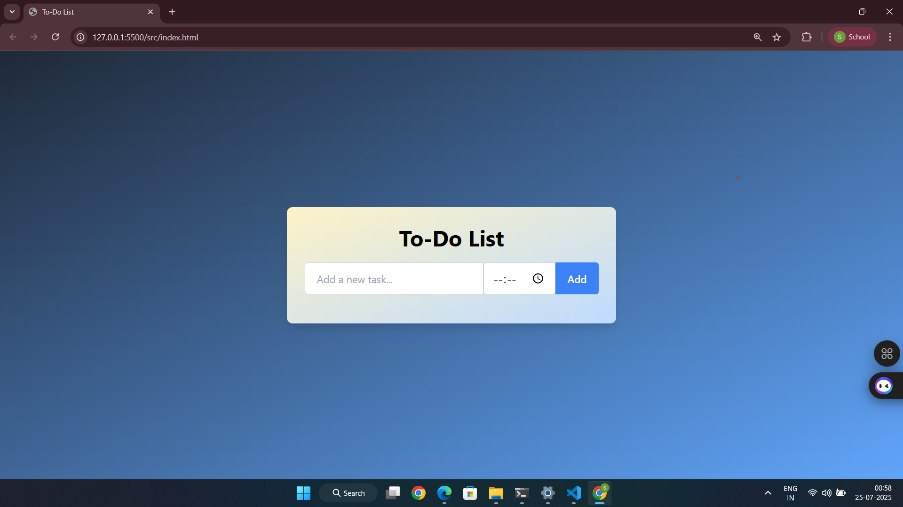

# Tailwind To-Do List




A simple and interactive To-Do List built using **HTML**, **Tailwind CSS**, and **JavaScript**.  
Tasks are stored locally using `localStorage` so your list stays even after refreshing the page.

---

## 🚀 Features

- Add tasks with time
- Toggle task completion
- Remove tasks
- Tasks persist on refresh
- Responsive & mobile-friendly UI

---

## 📸 Preview


---

## 🛠 Tech Stack

- HTML5
- Tailwind CSS
- JavaScript
- LocalStorage (for persistence)

---

## 📂 Project Structure

```
tailwind-project1/
├── index.html
├── script.js
├── style.css (optional)
├── tailwind.config.js
├── package.json
└── README.md
```

---

## 🧠 How to Use

1. Clone the repo  
   ```bash
   git clone https://github.com/varadsolanke/Tailwind-To-do
   cd Tailwind-To-do
   ```

2. Install dependencies  
   ```bash
   npm install
   ```

3. Start Tailwind CSS (in dev mode)  
   ```bash
   npx tailwindcss -i ./input.css -o ./output.css --watch
   ```

4. Open `index.html` in your browser.

---

## 📅 Last Updated

July 24, 2025

---

## ✨ Author

**Varad Solanke**  
🔗 [GitHub Profile](https://github.com/varadsolanke)

---

## 🪪 License

This project is licensed under the [MIT License](LICENSE).
